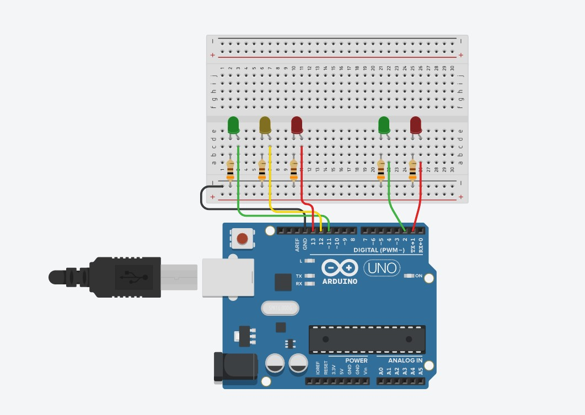

# Hi, I'm Gabriel! See my project below  👋

## SEMÁFORO | AULA 01

Os projetos são uma forma de fixar os conhecimentos aprendidos ao longo dos  textos anteriores. A ideia é usar todos os conceitos novos para montar algo que  tenha uma funcionalidade ou aplicação mais complexa e divertida, como, por  exemplo, o semáforo de LEDs que vamos montar a seguir

Os principais tópicos abordados durante o desenvolvimento foram:

- Importar fontes externas.
- Usar css externo (⬆ Organização do código).
- Responsividade de tela.

### 🛠 Lista de materiais

- 1 WORKPLATE ARDUINO BLACK COM CABO USB
- 2 LEDs VERDES 5mm
- 1 LED AMARELO 5mm
- 2 LEDs VERMELHOS 5mm
- 5 RESISTORES 300Ω
- JUMPERS
## Screenshots

