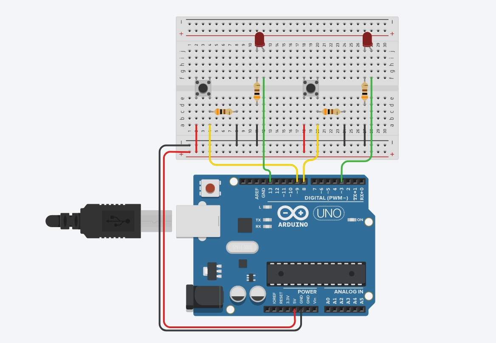

# Hi, I'm Gabriel! See my project below  👋

## SEMÁFORO | AULA 01

otão é um dos dispositivos mais populares quando se fala de interface humano-máquina. Seja no seu smartphone, nos elevadores ou até mesmo em sua 
própria sala, com o interruptor de luz, os botões são responsáveis por disparar 
ações em diversos sistemas eletrônicos presentes no nosso dia a dia. 
Com um simples apertar, você pode ligar uma lâmpada, travar a tela do seu celular ou interagir com um jogo eletrônico. Onde mais encontramos botões?

Os principais tópicos abordados durante o desenvolvimento foram:

- Importar fontes externas.
- Usar css externo (⬆ Organização do código).
- Responsividade de tela.

### Entradas digitais
Você viu como os pinos do Arduino funcionam como saída digital: a 
energia circula por eles até o LED. Entretanto, eles também podem 
ser configurados para fazer o contrário, deixando que a energia circular de fora para dentro, podendo ser medida. Assim, fica fácil detectar quando a tensão que entra no Arduino é 5V e quando é 0V.
Desse modo, quando queremos usar um botão com nossa placa, 
basta conectá-lo corretamente a um pino que esteja configurado como entrada. Depois disso, poderemos detectar se o botão 
está pressionado ou solto

### Resistor de pull-down

Se você simplesmente conectar um dos pares de terminais ao 5V 
e o outro ao pino do Arduino, quando você pressionar o botão, 
o pino terá os 5V. Então, qual sinal chegará ao pino do Arduino 
quando o botão não estiver pressionado? Nenhum? Na verdade, a 
melhor resposta seria “qualquer coisa”, pois, como não há nenhum 
sinal válido (5V ou 0V) conectado a ele, o caminho fica livre para os 
ruídos existentes no circuito. O pino do Arduino poderá assumir 
um valor lógico verdadeiro ou falso a qualquer momento.
Para retirar essas flutuações que prejudicam a interpretação dos 
sinais, utilizamos um resistor de pull-down. Ele atua garantindo 
que o sinal de GND chegue até 
o pino enquanto o botão não for 
pressionado e protege o circuito 
contra um curto circuito quando 
você aperta o botão. Veja um exemplo de ligação na imagem ao lado:

### 🛠 LISTA DE MATERIAIS
- 1 WORKPLATE ARDUINO BLACK COM CABO USB
- 1 LED 5mm
- 1 RESISTOR 300Ω
- 1 BOTÃO (PUSHBUTTON)
- 1 RESISTOR 10KΩ
- 1 PROTOBOARD
- JUMPERS

## Screenshots

